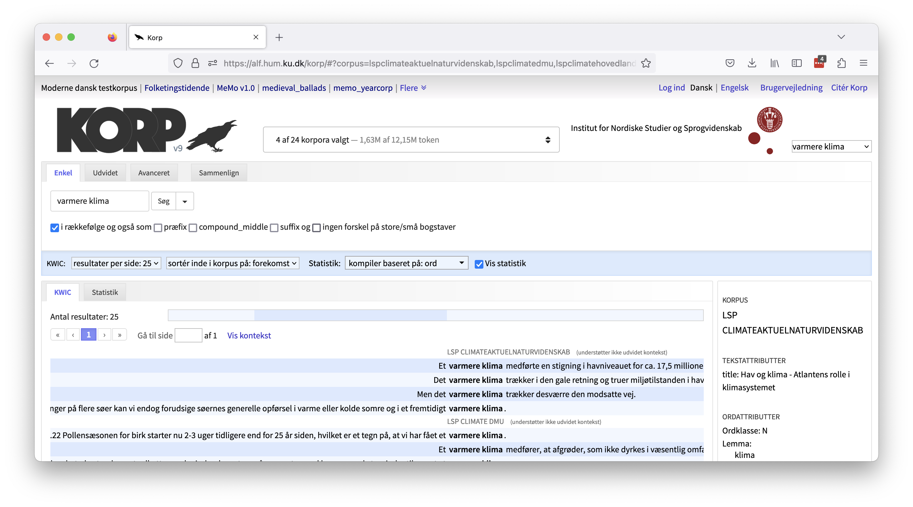
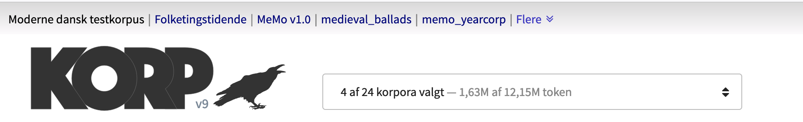
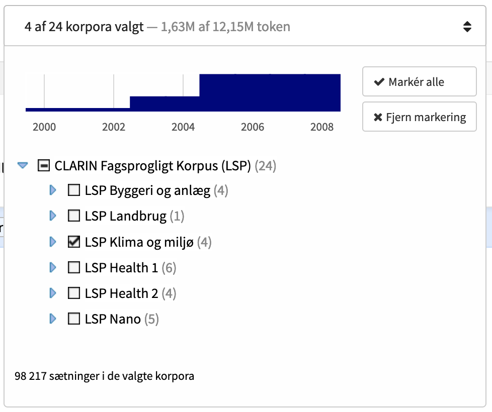
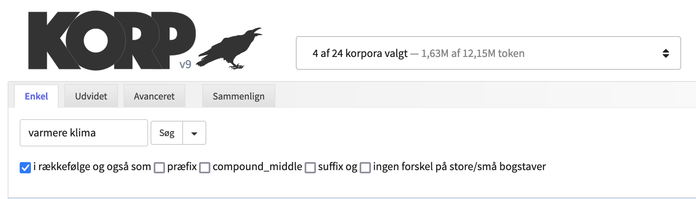
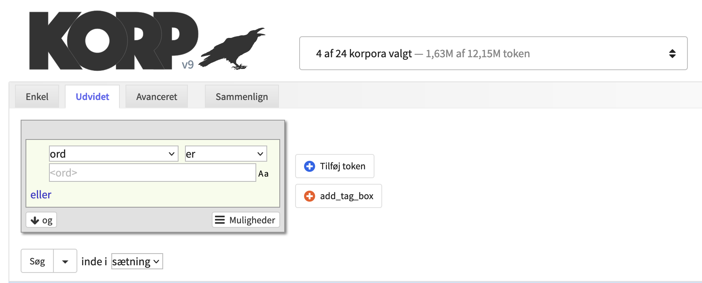
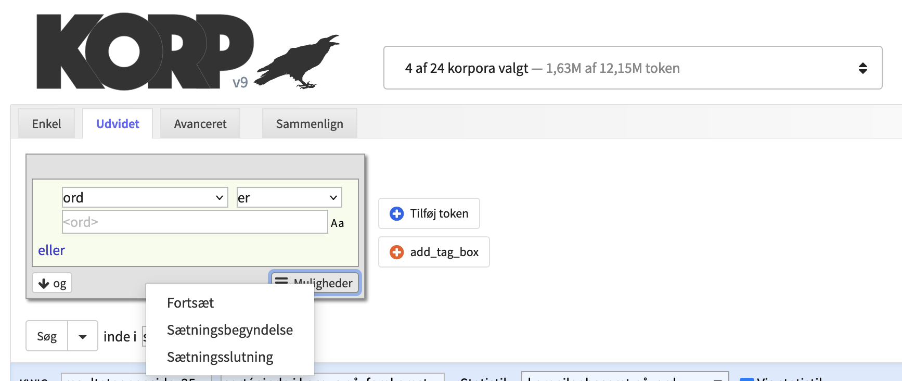
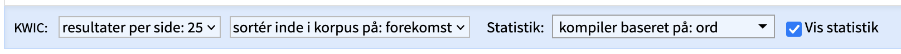
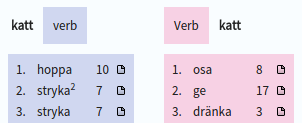

# Brugervejledning til Korp

(For a user guide in English, see [the original Korp user manual from Språkbanken](https://github.com/spraakbanken/korp-frontend/blob/dev/doc/user_manual_eng.md)).

## Introduktion

Dette er en brugervejledning til korpussøgeværktøjet Korp.

Der findes forskellige offentligt tilgængelige instanser af Korp. De beskrevne funktioner er ikke nødvendigvis tilgængelige i dem alle.

Korp-instanser med diverse offentligt tilgængelige korpusser:

- [alf.hum.ku.dk/korp](https://alf.hum.ku.dk/korp) (Clarin Danmark)
- [spraakbanken.gu.se/korp](https://spraakbanken.gu.se/korp) (Språkbanken/Clarin Sverige)
- [korp.csc.fi/korp](https://korp.csc.fi/korp) (Kielipankki: Den finske sprogbank)
- [gtweb.uit.no/korp](http://gtweb.uit.no/korp) (Giellatekno: Forskningsgruppen for samisk sprogteknologi ved Norges Arktiske Universitet/Clarin Norge)
- [malheildir.arnastofnun.is](https://malheildir.arnastofnun.is) (Árni Magnússon-instituttet for islandske studier ved Islands Universitet)

Derudover har Sprogforandringscentret ved Københavns Universitet sin egen instans af Korp med det store LANCHART-talesprogskorpus. Det er dog kun tilgængeligt til forsknings- og undervisningsbrug. Se [Sprogforandringscentrets side om korpusset](https://dgcss.hum.ku.dk/online-ressourcer/lanchart-korpusset/) for information om hvordan man kan få et login.

- [lanchartkorp.ku.dk](https://lanchartkorp.ku.dk) (Sprogforandringscentret, KU)

Se evt. disse andre, mere specifikke brugervejledninger:

- [Korp användarhandledning](https://github.com/spraakbanken/korp-frontend/blob/dev/doc/user_manual_swe.md) (Sveriges sprogbank)
- [Korp user manual](https://github.com/spraakbanken/korp-frontend/blob/dev/doc/user_manual_eng.md) (Sveriges sprogbank)
- [Korp](https://www.kielipankki.fi/support/korp) (Finlands sprogbank)
- [Korp - Advanced](https://www.kielipankki.fi/support/korp-advanced) (Finlands sprogbank)

## Forskellige modes i Korp

Materialet i Korp kan opdeles i forskellige modes. Helt øverst på siden, over Korp-logoet, kan man finde links til de forskellige modes, fx moderne sprog, parlamentstekster eller romantekster. Funktionaliteten kan variere mellem de forskellige modes.

## Korpusvælgeren

Til højre for Korp-logoet finder man *korpusvælgeren*, som bruges til at vælge det eller de korpusser, man vil søge i. Nogle korpusser er lagt i fælles kategorier. Man kan vælge mellem de enkelte korpusser i en kategori ved at klikke på de små blå pile for at folde kategorien ud og derefter vælge korpusser ved at sætte flueben ud for dem, eller man kan vælge alle korpusser i en kategori ved at sætte flueben ud for kategorien.

For at få flere oplysninger om et korpus kan man holde musen over et kategori- eller korpusnavn i korpusvælgeren. Så kan man se antal tokens og antal sætninger (hvis det understøttes) samt en beskrivelse.

Over listen af korpusser i korpusvælgeren er der et lille søjlediagram der viser fordelingen af materialet over tid. De valgte korpusser vises som blå søjler, og det resterende materiale er vist med gråt. Materiale der ikke indeholder tidsinformation, vises i en ekstra lille rød søjle til højre for søjlediagrammet.

## Søgning i Korp

Korp-grænsefladen er opdelt i to hovedsektioner: en øvre sektion, hvor søgeparametrene specificeres, og en nedre sektion, hvor søgeresultatet vises. Søgesektionen har tre forskellige søgemuligheder: *Enkel*, *Udvidet* og *Avanceret* søgning, med hver sin grad af kompleksitet.

Fanen *Enkel* tillader kun søgninger efter ord eller sætninger, mens man i fanen *Udvidet* kan opbygge mere komplekse søgninger vha. bokse og menuer. Fanen *Avanceret* kræver et godt kendskab til det søgesprog der bruges i Korp (CQP-søgesproget, CQP for "Corpus Query Processor").

### Enkel søgning

I en enkel søgning kan man vælge at søge på et eller flere ord. For at lave en almindelig ordsøgning indtaster man ordet/ordene i søgefeltet og klikker på søgeknappen eller taster på Enter på tastaturet (NB: Enter-tasten kan ikke bruges i de andre søgemuligheder). 

Under søgefeltet er et antal afkrydsningsfelter der giver mulighed for at specificere søgningen yderligere.

**I rækkefølge**
Når man søger efter mere end ét ord, søges der efter alle ordene ved siden af hinanden og i den angivne rækkefølge. Ved at fjerne fluebenet ved *i rækkefølge* vil søgningen i stedet finde alle sætninger der indeholder søgeordene, hvor rækkefølgen nu er ligegyldig og ordene ikke behøver stå ved siden af hinanden.

**Præfiks og suffiks**
Felterne *præfiks* og *suffiks* udvider søgningen til ord der begynder eller slutter med den angivne søgestreng. Flueben ved *compound_middle* giver resultater hvor søgestrengen indgår i ordet.

**Søgning uden forskel på store og små bogstaver**
Der er også et felt for *ingen forskel på store/små bogstaver*. Hvis der er sat flueben her, vil resultatet indeholde både store og små bogstaver (dvs. en søgning efter "kat" vil også returnere "KAT" og "Kat").

### Udvidet søgning

Fanen *Udvidet* giver mulighed for at bygge mere komplekse søgninger. Hver grå boks repræsenterer et *token* (et ord eller et interpunktionstegn), og forskellige kriterier kan specificeres for hvert token. Tryk på "+"-knappen til højre for at tilføje et token eller X'et i øverste højre hjørne af en boks for at fjerne et token. Det er muligt at ændre token-rækkefølgen ved at trække boksene til en ny position med musen.

For at definere søgekriterier for et token vælger man en attribut fra menuen til venstre i en boks. Standardindstillingen er at søge efter en ordform, men man kan vælge at søge efter ordled, lemmaer eller diverse annotationer i stedet for. Menuen til højre i boksen giver mulighed for negationer ved at ændre "er" til "er ikke". Nogle attributter tillader søgninger efter forekomster der "begynder med", "indeholder" eller "slutter med" søgestrengen, eller man kan bruge [regulære udtryk](regex) ved at vælge "matcher" eller "matcher ikke".

I tekstfeltet under menuerne skrives søgestrengen. Nogle attributter (fx ordklasse) har en  drop-down-menu man kan vælge fra i stedet for et tekstfelt.

Det lille "Aa"-symbol til højre for tekstfeltet styrer for hvert token om søgningen skal være følsom for store/små bogstaver eller ej. Der skelnes som standard mellem store og små bogstaver.

---
&#x26a0;&#xfe0f; **BEMÆRK**: Søgninger der ikke skelner mellem store og små bogstaver, er betydeligt langsommere end søgninger der gør.

---

Hvis man vælger attributten "Ordform" og ikke indtaster nogen værdi, søges der efter et hvilket som helst token, dvs. søgningen matcher alle tokens.

For hvert token er det muligt at specificere flere kriterier på følgende måde: *((A eller B eller C) og (E eller F) og ...)*. Det lyse område i en tokenboks repræsenterer en gruppe af *eller*-kriterier. Tryk på "eller" i nederste venstre hjørne for at tilføje et *eller*-kriterie. For at tilføje kriterier med *og* (inklusive en ny *eller*-gruppe) trykker man på "og"-knappen i nederste venstre hjørne.

**Gentagelse, sætningsbegyndelse og sætningsslutning**
I nederste højre hjørne af hver token-boks er der en menu som giver yderligere søgemuligheder.

Den første, *Gentag*, specificerer at det aktuelle token skal gentages som angivet. Ved at tilføje en tokenboks med *Ethvert ord* og *Gentag 1 til 3 gange* kan man definere en variabel sekvens i sin søgning med mindst ét og maks. tre vilkårlige tokens.

De to andre kriterier i denne menu er *Sætningsbegyndelse* og *Sætningsslutning*, som specificerer at det aktuelle token skal være det første eller det sidste i sætningen. Husk at tegnsætning også tæller som et token, hvilket betyder at det sidste token i en
sætning oftest er et punktum.

**Søg på tværs af sætningsgrænser**
Som standard udføres alle søgninger *indenfor* sætningsgrænser, hvilket betyder at man aldrig får et match, der rækker ud over en sætning. For nogle korpusser er det dog muligt at tillade match der spænder over en større mængde tekst, fx et afsnit, hvilket gør det muligt at søge på tværs af sætningsgrænser.

Muligheden for at aktivere dette kan findes lige til højre for søgeknappen under Udvidet søgning. Hvis det valgte korpus ikke understøtter udvidet kontekst, er det kun "sætning" der kan vælges her. Men hvis der er valgt mindst ét korpus der tillader udvidet kontekst, vil det være muligt at vælge en udvidet kontekst på listen, fx "op til afsnit". Det betyder, at søgningen vil blive udført indenfor afsnitsgrænsen *for de korpusser der understøtter det*, og indenfor den størst mulige kontekst der er mindre end et afsnit, for dem der ikke understøtter det (dvs. en sætning i de fleste tilfælde).

### Avanceret søgning

Uanset om man bruger Enkel eller Udvidet søgning, konverteres søgningen til et søgeudtryk på CQP-søgesproget. Under fanen *Avanceret* vises CQP-søgeudtrykkene for Enkel og Udvidet søgning, og det er muligt at specificere en søgning direkte i CQP hvis søgningen skal være mere avanceret end hvad der p.t. kan lade sig gøre i en udvidet søgning.

For at læse mere om CQP-søgesproget, se [CQP Query Language Tutorial](https://cwb.sourceforge.io/files/CQP_Tutorial.pdf).

## Søgeresultater

Resultatvisningen er opdelt i to forskellige sektioner: *KWIC* og *Statistik*.

Uanset hvilken version af søgegrænsefladen man bruger, er der en række tilpasningsmuligheder i en stribe under søgefelterne. For KWIC-konkordansen kan man vælge antallet af hits per side samt sorteringsrækkefølge. Sortering kan udføres enten på højre eller venstre kontekst, på selve matchet eller tilfældigt. Bemærk at sorteringen kun sker indenfor hvert korpus. Med standardindstillingen "forekomst" vil resultaterne blive vist i den rækkefølge de står i korpusset.

For statistikken kan man vælge hvilken attribut statistikken skal opdeles efter.

Det er også muligt at deaktivere statistikfunktionen i resultatvisningen hvis man ikke er interesseret i statistikken og ønsker at gøre søgningen lidt hurtigere.

### KWIC

KWIC-konkordansen (KWIC = "keyword in context") viser det eller de søgte ord i deres kontekst. Hvis der er mange søgeresultater, er de opdelt i sider. Man kan bladre frem og tilbage mellem siderne ved at taste *n* (for "næste") og *f* (for "forrige") på tastaturet.

Forudsat at man har søgt i mere end ét korpus, vil der være en farvet stribe til højre for antallet af hits. Her vises antallet af hits i de forskellige korpusser, og ved at holde musen over de forskellige felter kan man se hvilke korpusser de repræsenterer. For hurtigt at komme til resultaterne fra et bestemt korpus, kan man klikke på det ønskede korpus
i denne stribe.

Søgehits er grupperet efter korpus, og små overskrifter i KWIC-visningen angiver hvilke korpusser resultaterne kommer fra.

**Sidepanel**
Man kan markere et token ved at klikke på det i KWIC-konkordansen, og så vises der et sidepanel i højre side. Denne sidebar indeholder annotationer af det valgte token (under overskriften *Ordattributter*), og eventuelt også om den sætning eller større tekst tokenet indgår i (under *Tekstattributter*).
Ordattributterne er annotationer som ordklasse, lemma osv., mens tekstattributterne kan være forfatter, udgivelsesår og lignende.

Nogle attributter er klikbare og fører til nye søgninger eller lignende.

Når et ord er markeret, vil dets syntaktiske hoved i samme sætning også blive fremhævet med en lyserød baggrund (dog kun når syntaktiske annoteringer er tilgængelige).

**Udvidet kontekst**
I nogle korpusser er det muligt at se en større kontekst end en sætning, typisk et helt afsnit. For at vise mere kontekst kan man klikke på linket "Vis kontekst" over KWIC-konkordansen. Dette skifter til en alternativ resultatvisning hvor der vises mere kontekst (hvor det understøttes), og hver resultatlinje er opbrudt i kortere linjer for lettere læsning.

**Download**
Nederst på siden under konkordanslinjerne er der mulighed for at downloade den aktuelle sides søgeresultater i forskellige formater.

### Statistik

Fanen Statistik viser en tabel hvor hver kolonne svarer til et korpus og rækkerne er opbygget af de forskellige ord eller annotationer der er søgt på. Som udgangspunkt beregnes statistikken på ordformer, og en enkel søgning på én ordform vil derfor kun give én række, mens en søgning på fx et leksem giver en række per ordform der forekommer i materialet.

Man kan vælge at beregne statistikken på diverse annotationer, fx ordklasse, forfatterkøn eller andet. Man kan også vælge om statistikberegningen skal tage højde for store og små bogstaver eller ej. Ved at klikke på søgeresultatet i en tabelrække kan man lave en ny KWIC-søgning der åbner i en separat fane. Her vises så netop de forekomster der var grundlag for den givne række.

Tabellens celler viser antallet af forekomster i hvert korpus, både i absolutte tal (i parentes) og i relative tal. De relative tal viser antallet af resultater per million tokens.

Ved at klikke på kolonneoverskrifterne kan man sortere tabellen i stigende eller faldende rækkefølge efter den valgte kolonne.

Lige til venstre for totalkolonnen har hver række et lille symbol, som giver mulighed for at åbne et cirkeldiagram der viser fordelingen af hits i de forskellige korpusser, igen i absolutte eller relative tal.

Nederst på siden, under tabellen, er der mulighed for at downloade statistiktabellen i forskellige formater.

### Sammenligninger

Det er muligt at køre en statistisk korpussammenligning af resultaterne fra to søgninger. For at gøre det skal man først gemme to søgninger. Dette kan gøres fra alle søgefanerne ved at oprette et søgeudtryk og derefter klikke på pilen til højre for søgeknappen. Så kan man gemme søgningen til senere effektuering under et navn efter eget valg. Når man har gemt to søgninger, kan man gå til fanen *Sammenligning* til højre for de tre søgefaner. Her vælger man de to søgninger man vil sammenligne, og derefter hvilken annotation sammenligningen skal udføres på. Et eksempel på en sammenligning kunne være en søgning på alle substantiver i ét korpus og alle substantiver i et andet korpus, med sammenstilling på ordform. Når sammenligningen er færdig, præsenteres to kolonner med ordformer: Den første viser de ordformer der er mest karakteristiske for søgning 1 (dvs. det første korpus) sammenlignet med søgning 2 (dvs. det andet korpus), og den anden viser ordformer der er karakteristiske for søgning 2 sammenlignet med søgning 1. Kolonnerne er sorteret i faldende rækkefølge efter log-likelihood, et statistisk mål for hvor karakteristiske forekomsterne er. Tallene til højre viser absolut frekvens.

### Trenddiagram
Hvis nogen af de valgte korpusser indeholder tidsinformation, kan man få vist en tidslinje, også kaldet et trenddiagram. Trenddiagrammet er baseret på rækker i statistiktabellen og viser deres relative hyppighed over tid. Den relative hyppighed beregnes som antallet af hits per million tokens for hver specifik tidsenhed.

For at få vist trenddiagrammet skal man først vælge en eller flere rækker fra statistiktabellen ved at sætte flueben ved dem og derefter klikke på knappen *Vis trenddiagram*. Så vises trenddiagrammet i en ny fane. Diagrammets vandrette akse viser tid, og den lodrette viser relativ frekvens. Hver linje i diagrammet svarer til en af de valgte rækker i statistiktabellen, og i den lille signaturforklaring til højre kan man skifte mellem de rækker man vil vise. Ved ved at klikke på et punkt på en linje, åbnes en ny fane med alle hits for det pågældende tidspunkt.

Under trenddiagrammet er der en miniatureversion af diagrammet med håndtag der kan bruges til at zoome ind og panorere rundt i det store diagram. Opløsningen af trenddiagrammets tidsakse bestemmes af størrelsen på det viste tidsrum, og ved at zoome ind er det muligt at få vist tidsinformation helt ned på sekundniveau (så længe det valgte materiale understøtter det).

### Ordbillede

---
&#x26a0;&#xfe0f; **BEMÆRK**: Ordbilledefunktionen er p.t. ikke tilgængelig i denne instans af Korp. Se evt. [Språkbankens Korp](https://spraakbanken.gu.se/korp).

---

Ordbillede-funktionen er deaktiveret som standard og skal først aktiveres ved at sætte flueben ved "Vis ordbillede" i søgeindstillingerne.

Ordbillede-fanen er kun aktiv, når man har søgt på et *enkelt ord* eller et *leksem* fra *Enkel* søgning. Her vises det søgte ord sammen med ord det har syntaktiske relationer til i materialet, grupperet efter relation. For et verbum vises for eksempel de subjekter og objekter, der er særligt karakteristiske for det pågældende verbum, og for et substantiv vises karakteristiske modifikatorer samt verber hvor substantivet er subjekt og objekt.

Som standard vises der maksimalt 15 ord for hver relation, men til højre på siden er der mulighed for at vise flere.

Tallet ud for hvert ord angiver, hvor mange gange den givne relation findes i det søgte materiale. Listerne er ordnet efter den statistiske enhed "lexicographer's mutual information".

Ved at klikke på det lille ikon ud for hvert ord, kan man få en ny KWIC-fane frem med alle konkordanslinjer hvori den valgte relation findes.

### Kort

---
&#x26a0;&#xfe0f; **BEMÆRK**: Kortfunktionen er p.t. heller ikke tilgængelig i denne instans af Korp. Se evt. [Språkbankens Korp](https://spraakbanken.gu.se/korp).

---

Kortfunktionen er ligesom trenddiagrammet baseret på rækker i statistiktabellen. Hvis kortfunktionen er tilgængelig, kan man få vist et kort ved at vælge en eller flere rækker i statistiktabellen og derefter klikke på knappen "Vis kort".

I menuen der kommer frem, vælger man hvilke annotationer man vil basere kortet på. For nogle korpusser er det kun muligt at basere kortet på samtidig forekomst med stednavne på sætnings- eller afsnitsniveau, dvs. der søges efter stednavne i samme kontekst som den givne forekomst af søgeordet. For andre korpusser er der også stedoplysninger i metadataene (fx en bloggers hjemby eller andet), og så kan kortet baseres på dem i stedet.

Når man har foretaget sit valg og klikket på knappen "Vis kort", vises kortet i en ny fane.

