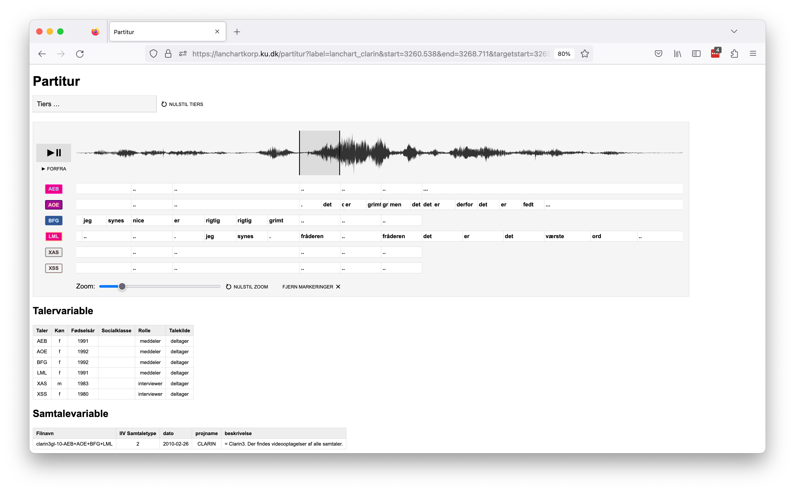
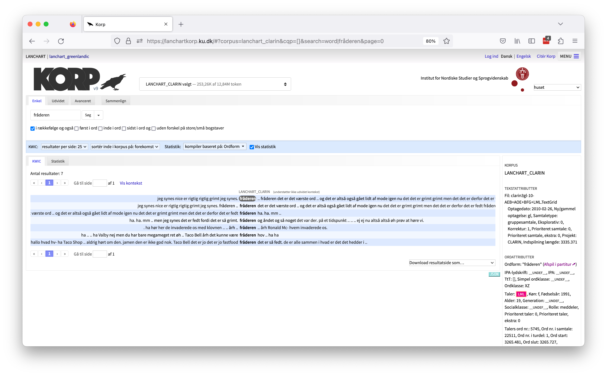

# Partiturvisningen

LANCHARTs partiturvisning er udviklet
til at vise talesprogsdata synkroniseret med lydsignalet fra en
given optagelse. Partiturvisningen har forskellige features, der
løbende vil blive udbygget og ændret efter behov. 

## Partiturvisningen og Korp

Partiturvisningen er så at sige en satellit til vores instans af Korp
([lanchartkorp.ku.dk]()) idet det er en selvstændig 
webapplikation der samtidig ikke kan bruges til ret meget i sig selv;
den har ingen søgegrænseflade og er dermed afhængig af at modtage de
nødvendige søgeparametre udefra via webapplikationens URL. Fra Korp
sendes disse parametre af sted via et link ("Afspil i partitur ➚",
som kan anes til højre i skærmbilledet nedenfor) der genereres af information
knyttet til hvert token som annotationer.

## Afspilning af lyd

Partiturvisningen er udformet som en lydafspiller med en play/pause-knap,
hvor lydsignalet vises som en lydbølge synkroniseret med udskrifterne af
de forskellige talere.

Play/pause-knappen og knappen "Forfra" under den kan betjenes fra tastaturet
vha. hhv. mellemrumstasten (space) og skift+mellemrumstast (shift+space).

## Afspilning af markeringer

Den grå
markering på lydbølgen repræsenterer et stykke der kan afspilles separat;
det gøres ved at klikke på markeringen. Partiturvisningen er designet til
automatisk at markere en sekvens svarende til en given start- og sluttidskode,
typisk det matchende ord i en konkordanssøgning. Men man kan lave så mange
yderligere markeringer man vil med musen og også trække dem længere eller
kortere (og til sidst helt væk) eller flytte dem i deres helhed. Samtlige
markeringer kan fjernes med et klik på knappen "Fjern markeringer".

## Annotationslag

Under knappen "Tiers ..." gemmer der sig en menu hvor
man kan klikke diverse annotationslag (svarende til tiers i de tilgrundliggende
TextGrids) til og fra. På billedet er IPA-kodningen klikket til.

## Metadata

Under selve partituret vises to tabeller med metadata, en med
talervariable og en med samtalevariable.

## Zoomfunktion

En
zoomfunktion gør det muligt at gøre visningen af partituret bredere eller
smallere. Træk i slideren i partituret for at gøre dette.

