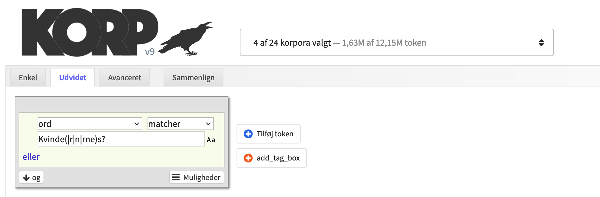

# Regulære udtryk

Regulære udtryk er en søgesyntaks med jokertegn der kan være meget nyttig i Korp-søgninger. Derfor denne lille introduktion.

I Korp kan man søge ved hjælp af regulære udtryk ved at vælge "matcher" eller "matcher ikke" i menuen øverst til højre i en tokenboks.

Her kan man ved hjælp af diverse specialtegn specificere hvilke tegn der skal forekomme hvor og hvor mange gange i de ord Korp-søgningen skal matche. Man kan også ved hjælp af lodret streg (|) specificere en "eller"-søgning - dvs. en liste af ord Korp skal søge efter.

| Regulært udtryk | Forklaring |
| --- | --- |
| .+ | Vilkårligt tegn 1 eller flere gange |
| .* | Vilkårligt tegn 0 eller flere gange |
| .? | Vilkårligt tegn 0 eller 1 gange |
| . | Vilkårligt tegn 1 gang |
| .{2,4} | Vilkårligt tegn 2-4 gange |
| æ+ | 1 eller flere æ’er efter hinanden |
| Kvinde.+ | “Kvinde” med 1 eller flere bogstaver efter |
| [au] | a eller u |
| h[au]n | han eller hun |
| han\|hun\|de | han eller hun eller de |

Man kan også kombinere de forskellige specialtegn og bruge parenteser til fx at specificere et sted i strengen hvor forskellige alternativer må forekomme.

| Regulært udtryk | Forklaring |
| --- | --- |
| Kvinde(\|r\|n\|rne)s? | Alle 8 bøjede former af “Kvinde”. (Bemærk den “tomme streng” før den første lodrette streg). |
| be.+ing | Ord der begynder med “be” og slutter med “ing”. |
| (be\|ge\|er\|for).+ing | Ord der begynder med “be”, “ge”, “er” eller “for” og slutter med “ing”. |
| Kj?ærlighed | “Kærlighed” eller “Kjærlighed”. |
| være\|er\|var\|været | Forskellige bøjninger af “være”. |
| .+(hed\|ing) | Ord der slutter med “hed” eller “ing” (oftest substantiver). |
| .+(isk\|ig) | Ord der slutter med “isk” eller “ig” (oftest adjektiver). |

Regulære udtryk kan mere end det der er vist her. Søg på nettet efter "regulære udtryk" eller "regular expressions" for mere information. 